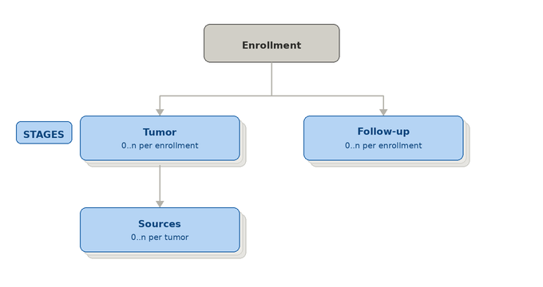
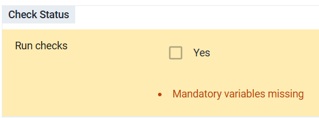
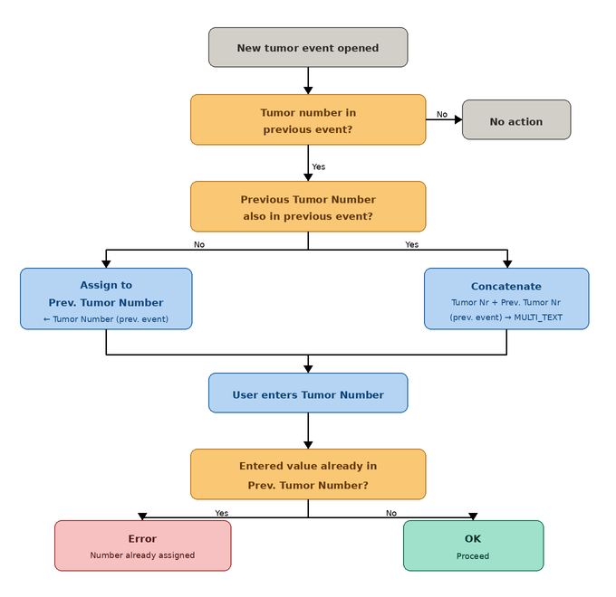
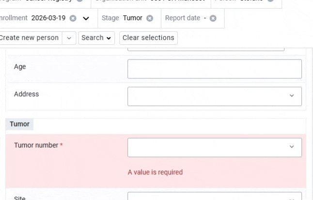
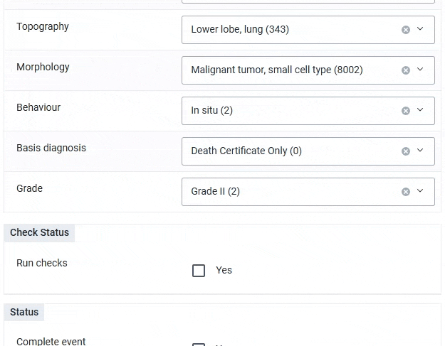
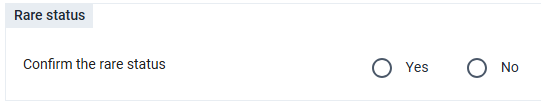
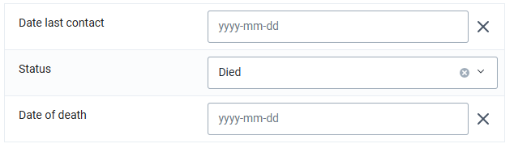

# Cancer Registry Module - System Design Guide { #ncd-cr-design }

## Introduction

The DHIS2 Toolkit for Cancer Registry is based on internationally recognised standards and principles for population-based cancer registration, as defined by the International Agency for Research on Cancer (IARC) in [*Cancer Registration: Principles and Methods*](https://publications.iarc.who.int/Book-And-Report-Series/Iarc-Scientific-Publications/Cancer-Incidence-In-Five-Continents-Volume-IX-2007) (IARC Scientific Publications No. 160, 2021) and operationalised through the CanReg5 software developed by IARC.This toolkit includes a DHIS2 Tracker program aligned with CanReg5 data standards for individual-level cancer case registration, supporting population-based monitoring at registry level, as well as a custom DHIS2 application to export Tracker program data to CanReg5 format.

The Cancer Registry toolkit is designed to support population-based cancer registries in strengthening their routine data management processes and improving the quality, completeness, and timeliness of cancer case registration. The DHIS2 Cancer Registry tracker is not designed to provide clinical decision-support, but rather serves as an operational tool for individual-level case capture and a source of data for cancer surveillance and epidemiological analysis. It is aligned with CanReg5 data standards for individual-level cancer case registration, supporting population-based monitoring at registry level. 

This system design document explains the reference configuration in DHIS2 for the cancer registry use case, including a detailed description of the DHIS2 Tracker configuration and data quality control mechanisms. This document does not address the resources and infrastructure needed to implement such a system (such as servers, power, internet connectivity, backups, training, and user support) which are covered in the **DHIS2 Tracker Implementation Guide**. 

Reference metadata for this toolkit is available at: [dhis2.org/metadata-downloads](https://dhis2.org/metadata-downloads/).

### Acknowledgements

The DHIS2 Toolkit for Cancer Registry has been developed with financial support from Vital Strategies and technical guidance from the International Agency for Research on Cancer (IARC). We are grateful to IARC for providing subject matter expertise in cancer registration standards and the CanReg5 data model throughout the design and development of these tools. We would also like to thank the HISP Groups who participated in the consultations and contributed their implementation experience to the development of this toolkit.

## System Design Overview

### Background

Cancer represents one of the leading causes of morbidity and mortality worldwide, with the global burden increasingly concentrated in low- and middle-income countries (LMICs) where health systems are often least equipped to respond. Reliable, high-quality data on cancer incidence, case characteristics, and outcomes are essential for informing national cancer control planning, allocating resources, monitoring trends over time, and evaluating the impact of prevention and treatment programmes. Population-based cancer registries are the primary instrument for generating this evidence, and their systematic strengthening is a priority for global cancer control.

Individual-level cancer case registration offers significant advantages over aggregate reporting. A case-based approach allows for flexible disaggregation by tumour site, morphology, age, sex, geographic origin, and other clinically and epidemiologically relevant variables. It also enables longitudinal follow-up of registered cases, supports deduplication of records across multiple reporting sources, and facilitates the application of systematic data quality checks to identify and correct incomplete or inconsistent entries. These capabilities are critical in the cancer registry context, where cases are typically notified from multiple sources — hospitals, pathology laboratories, death certificates — and must be consolidated into a single, verified record.

Despite their importance, population-based cancer registries in many LMICs face persistent challenges in data completeness, timeliness, and sustainability. Registry operations often rely on fragmented paper-based systems or standalone software tools that are difficult to maintain, integrate poorly with national health information systems, and require significant technical capacity to operate. [CanReg5](http://www.iacr.com.fr/index.php?option=com_content&view=article&id=9:canreg5&catid=68&Itemid=445), developed by IARC, has become the internationally recognised standard software for population-based cancer registration and provides a well-established data model and set of data quality control procedures. However, its integration into broader national digital health infrastructure — including routine health information systems managed by Ministries of Health — remains limited in many settings.

The DHIS2 Cancer Registry tracker is designed to address these challenges by leveraging the DHIS2 platform — already widely deployed in national health information systems across LMICs — to support individual-level cancer case registration aligned with CanReg5 data standards. By implementing cancer registration within DHIS2, this toolkit aims to facilitate the integration of cancer surveillance data into national health information infrastructure, reduce duplication of data management efforts, and support systematic data quality control at the point of registration.

### Use case

The DHIS2 Cancer Registry toolkit is designed to support routine individual-level cancer case registration to feed into population-based cancer registries. The system is built around the DHIS2 Tracker data model, aligned with the data standards and workflows of CanReg5, the internationally recognised software for population-based cancer registration developed by IARC.

The web-based data capture component of the system design allows registry staff to record and manage individual cancer cases drawn from multiple notification sources — including hospital records, pathology and cytology laboratory reports, and death certificates — and consolidate them into a single verified registry record. The tracker program supports the capture of core data elements required for population-based cancer registration, including patient demographics, tumour characteristics, basis of diagnosis, and source of notification.

A key feature of the system design is the implementation of systematic data quality control checks embedded within the tracker program. These checks are designed to identify incomplete, inconsistent, or implausible entries at the point of data entry or during routine registry operations, supporting registries in maintaining the standards of data quality required for valid epidemiological analysis and international comparability.

While the DHIS2 Cancer Registry tracker is not designed to support clinical case management or decision support, it serves as an electronic registry tool that enables structured, standardised cancer case registration within the national DHIS2 health information infrastructure.

> **Warning**
>
> The toolkit is intended as a baseline configuration, fully aligned with CanReg5 standards for streamlined data transfer into CanReg5. System administrators may need to localize the program by adding new data elements or attributes, but modification of the baseline configuration is strongly discouraged, as this would likely break the alignment with CanReg5 and program rule logic of the data quality checks.

### Intended Users

The DHIS2 Cancer Registry system design is intended to meet the needs of users at all levels of the cancer registry system. These users may include:

- **Cancer registry managers & staff (national & sub-national)**: data users responsible for overseeing the completeness and quality of cancer case registration, monitoring registry operations, and using registry data to support cancer control planning and reporting
- **Registry data entry staff**: users responsible for the day-to-day capture and management of individual cancer cases within the tracker program, including recording case notifications received from hospitals, laboratories, and other reporting sources, and applying data quality control procedures to ensure accuracy and completeness of registry records
- **Cancer programme data managers**: users responsible for overseeing data collection workflows, data quality assurance, and reporting functions for the national cancer registry programme
- **System admins / HMIS focal points**: Ministry of Health staff and/or core DHIS2 team responsible for maintaining the DHIS2 system, supporting local adaptation of the cancer registry configuration, and providing technical support to end users
- **Implementing partners and technical assistance providers**: organisations providing technical support to national cancer registries, including IARC, HISP Groups, and other partners involved in system implementation, training, and capacity building

## Tracker

### Tracker program structure

The tracker program structure is as follows:

| **Stage**      | **Description**                                                                                                                                                                                                                                                                                                           |
|----------------|---------------------------------------------------------------------------------------------------------------------------------------------------------------------------------------------------------------------------------------------------------------------------------------------------------------------------|
| **Enrollment** | The enrollment stage collects the basic demographic data about a person, including unique identifiers, as Tracked Entity Attributes (TEAs). Several of these core TEAs such as Family Name and Given name are shared across DHIS2 Tracker programs. The Tracked Entity Type for the Cancer Registry program is ‘Person’.  |
| **Tumor**      | This stage contained the core information related to the tumor. The stage is repeatable                                                                                                                                                                                                                                   |
| **Sources**    | This stage contained the core information related to the sources associated with each tumor. The stage is repeatable                                                                                                                                                                                                      |
| **Follow-up**  | This stage contained the information for the follow-up of the patient and it’s not associated to either tumor or sources The stage is repeatable                                                                                                                                                                          |

### Tracked Entity Type

The DHIS2 Cancer Registry tracker program allows for the enrollment of a tracked entity type [TET] 'person' into the cancer registry program. Each enrolled person represents an individual cancer patient registered in the population-based cancer registry. The TET is configured at the system level and may be shared with other DHIS2 tracker programs deployed within the same national instance, in line with standard [DHIS2 implementation practice](https://docs.dhis2.org/en/implement/health/dhis2-health-data-toolkit/common-metadata-library/design.html).

### Enrollment

The enrollment stage captures the core patient demographic information required to register an individual in the cancer registry program. As best practice, registry staff should first search for an existing record before creating a new enrollment, in order to avoid duplicate registrations of the same patient.

The attributes collected at enrollment represent the minimum dataset necessary for population-based cancer registration and have been mapped to the IARC standard data requirements. There are five key tracked entity attributes collected at this stage. These attributes are configured at the tracked entity type level and may therefore be shared across other tracker programs within the same DHIS2 instance. However, care must be taken when sharing the **Sex** attribute, as the option set assigned to this attribute uses numeric codes that are referenced in multiple data quality checks throughout the program. Any modification to these codes — or substitution with a differently coded option set — would break the logic of those checks. The OptionSet Sex has been mapped with the relevant [CanReg5 dictionary](https://github.com/IARC-CSU/CanReg5/blob/release/R45/src/canreg/common/resources/dictionaries/sex.tsv).

One attribute, the Patient ID, is automatically generated by the system at the point of enrollment. The pattern follows the same convention used in CanReg5: the identifier is 8 characters long, composed of the current year in four-digit format followed by a four-digit sequential number, in the form `CURRENT_DATE(yyyy)+SEQUENTIAL(####)`.

### Tumor

The Tumor stage is the central component of the Cancer Registry tracker program. It captures all key clinical and epidemiological information related to an individual cancer case, and is where the full set of data quality checks is applied at the point of registration. For a detailed description of the quality control checks, refer to the [dedicated section](#Checks) of this document.

The stage is structured into multiple sections, several of which are hidden from the data entry interface. These hidden sections serve specific functional purposes within the system design: they support the calculation logic underlying the quality control checks, control the data entry flow through program rules, feed the analytical outputs of the program, and enable data extraction via the Cancer Registry DHIS2 custom application.

| **Section**                 | **Visibility** | **Description**                                        |
|-----------------------------|----------------|--------------------------------------------------------|
| Patient                     | Visible        | Patient information                                    |
| Tumor                       | Visible        | Tumor information                                      |
| Check Status                | Visible        | Run multiple checks                                    |
| Checks                      | Not-visible    | Stored information of each individual check            |
| Morphology topography check | Not-visible    | Multistep morphology topography check                  |
| Multiple primary tester     | Not-visible    | Multistep multiple primary tester                      |
| Rare status                 | Visible        | Visible only to users that can confit the rare status  |
| Tumour ID                   | Not-visible    | Storing information needed for the CanReg5 exportation |

#### Mandatory elements

The only formally mandatory data element in the Tumor stage is the **Tumor Number**, which serves as the reference linking each tumor record to its corresponding sources and is essential for the data extraction process via the Cancer Registry custom application.

However, in practice, all data elements in both the patient and tumor sections must be populated in order for the data quality checks to execute correctly. The sole exception is the **Grade** field, which is not required when the behaviour code indicates a value other than malignant. This requirement is enforced by the program rule *CR - Can't run the checks if all mandatory element has not values*, which prevents the checks from running when any of the required fields are missing.

#### Patient

The patient section collects the demographic and geographic information associated with the cancer case. The central date field in this section is the **Incidence Date**, which is the reference date used for all analytical outputs in CanReg5. The Event Date — the DHIS2 system date recorded at the time of data entry — is a separate field whose value is determined by local implementation decisions: it may be set to the date of data entry, aligned with the incidence date, or reflect another locally relevant date. The decision to keep the incidence date as a dedicated data element rather than using the event date for this purpose is driven by the requirements of the Cancer Registry custom extraction application, which references the data element directly.

The **Age** field must be entered manually. It is used in data quality checks, and a program rule verifies the consistency between the entered age, the date of birth, and the incidence date, returning a warning if a discrepancy is detected. Further details are provided in the [quality checks section](#Checks) of this document.

The **Address** field uses an option set that contains placeholder values and must be customised prior to implementation to reflect the administrative geography of the country or region. Rather than using a data element of value type Organisation Unit for geographic coding, the recommended approach is to use text-type data elements combined with dependent dropdown lists, implemented through program rules using the Show option group action. This allows the configuration of cascading selection menus — for example, a first element listing administrative regions, followed by a second element that displays only the districts belonging to the selected region. This approach aligns with the CanReg5 convention for address coding, where the address variable is two characters in length and typically encodes a combination of two administrative levels.

#### Tumor

The tumor section is the primary data collection component of the Tumor stage. It captures the key variables that must be recorded for every cancer case, aligned and mapped to the IARC standard data requirements, with the addition of the **Tumor Number**, which serves as a local reference linking a specific tumor record to its corresponding sources.

The Tumor Number is conceived as a unique identifier for the tumor within the registry. It may be a sequential number or any other locally defined value, and has an option set of text type with numeric values assigned. Combined with the **Patient ID** collected at enrollment, the Tumor Number constitutes the **Tumor ID** — the composite identifier that uniquely identifies a tumor record within the system.

To prevent the same Tumor Number from being assigned to more than one tumor belonging to the same patient, a dedicated mechanism has been implemented using a set of program rules operating on a hidden **Tumor ID** section. 

A data element **Previous Tumor Number**, of value type `MULTI_TEXT`, shares the same option set as the Tumor Number element. When a new tumor event is opened, program rules inspect the values recorded in the previous tumor event. If a Tumor Number was recorded in the previous event, that value is assigned to the Previous Tumor Number element. If both a Tumor Number and a Previous Tumor Number were present in the previous event, the two values are concatenated and stored as two separate values within the `MULTI_TEXT` field. Once the Previous Tumor Number has been populated, a further program rule checks whether the value currently entered in the Tumor Number field of the active event already exists among the values stored in Previous Tumor Number. If a match is found, an error message is displayed informing the user that the selected Tumor Number has already been assigned to this patient and that a different value must be chosen.

The remaining data elements in the tumor section are aligned and mapped to the CanReg5 data standards and are used as inputs for the data quality checks described in the dedicated section of this document. With the exception of the topography field, all elements are free-selection inputs. The **Topography** field is implemented as a dependent dropdown list: the available topography codes are filtered based on the site selected by the user, so that only the topography values valid for the chosen site are presented for selection. 

To simplify data entry, each option includes the corresponding code in its name, allowing registry staff to search directly by code when selecting a value.

The options sets are mapped with the CanReg5 ICDO3.2 version:

| DHIS2 OptionSets      | **CanReg5 ICDO3.2**                                                                                           |
|-----------------------|---------------------------------------------------------------------------------------------------------------|
| **Site / Topography** | https://github.com/IARC-CSU/CanReg5/blob/release/R45/src/canreg/common/resources/dictionaries/topography.tsv  |
| **Morphology**        | https://github.com/IARC-CSU/CanReg5/blob/release/R45/src/canreg/common/resources/dictionaries/morphology4.tsv |
| **Behaviour**         | https://github.com/IARC-CSU/CanReg5/blob/release/R45/src/canreg/common/resources/dictionaries/behaviour.tsv   |
| **Basis diagnosis**   | https://github.com/IARC-CSU/CanReg5/blob/release/R45/src/canreg/common/resources/dictionaries/basis.tsv       |
| **Grade**             | https://github.com/IARC-CSU/CanReg5/blob/release/R45/src/canreg/common/resources/dictionaries/grade.tsv       |

> **Note**
>
>  The option sets used in this section, and the codes associated with each option, are mapped directly to the CanReg5 standards. It is critical that these codes are not modified during local implementation or system maintenance. Any alteration to the option codes will break the logic of the data quality checks, which rely on these values for their calculations

#### Check Status

This section allows the registry staff to trigger the execution of the data quality checks. When the user selects the **Run checks** option, a warning message is displayed for each check that has not been passed, allowing the user to review and correct the relevant entries.

As noted in the mandatory elements section, all data elements in the patient and tumor sections must have a value before the checks can be executed. The only exception is the Grade field, which is mandatory only when the behaviour code is malignant (3).

When Run checks is selected, data entry for the tumor section is blocked. If the user needs to modify any value after the checks have been run, they must uncheck the element to re-enable data entry. This behaviour is enforced by two program rules:

- CR - Block data entry if checks runned
- CR - Block data entry if checks runned - Grade

Once **Run checks** is selected, two additional check options become visible: 
**Run Topography Morphology check** and **Run Multiple primary check**. These 
have been implemented as separate steps because they require multi-stage  verification and the involvement of additional program rules that cannot be  executed in a single pass. Further details are provided in the  [Checks section](#Checks) of this document. When the main **Run checks** option  is selected, these two subsequent checks are mandatory in order to ensure that  the full set of quality control checks is executed.

#### Checks section

| **Data Elements**                           | **Value Type** |
|---------------------------------------------|----------------|
| CR - Checks: Rare Age Morphology            | Boolean        |
| CR - Checks: Rare Age Topography            | Boolean        |
| CR - Checks: Rare Age Topography Morphology | Boolean        |
| CR - Checks: Rare Basis                     | Boolean        |
| CR - Checks: Invalid Grade                  | Boolean        |
| CR - Checks: Rare Sex Morphology            | Boolean        |
| CR - Checks: Invalid Sex Topography         | Boolean        |
| CR - Checks: Rare Topography Behaviour      | Boolean        |
| CR - Checks: Rare Topography Morphology     | Boolean        |
| CR - Checks: Multiple primary test result   | Option Set     |
| CR - Rare                                   | Boolean        |
| CR - Invalid                                | Boolean        |

This section is always hidden from the data entry interface. It contains all  data quality checks, each implemented as a separate data element. By default,  all checks are assigned a false value by the program rule *CR - Clear all  checks*, which resets any checks that previously returned a true result  whenever the **Run checks** element is unchecked.

The only check with a different value type is the **Multiple primary test  result**, whose output is not a boolean but one of three possible values: 
*Duplicate primary*, *Multiple primary*, or *Unknown topography*. The full 
logic of each check is described in the [Checks section](#Checks) of this  document.

In addition to the individual checks, this section contains two summary  classification elements: **Rare** and **Invalid**. Like the other check  elements, both are reset to false each time the **Run checks** element is  unchecked. Their true values are then assigned when the checks are executed:  the **Rare** element is set to true if any check with a rare output returns a  true result; the **Invalid** element is set to true if any check with an  invalid output returns a true result.

These two elements serve a dual purpose. They can be used in analytical outputs  to restrict counts to tumors that have passed all quality control checks, and  they can be applied as filters in working lists and line lists to identify and  review cases flagged as rare or invalid.

A tumor is classified as **Rare** when the combination of entered values — such  as morphology, topography, age, and other variables — represents a combination  that can rarely occur, and a supervisor must confirm that the data entered is  correct. Further details are provided in the  [Rare status section](#rare-status) of this document.

A tumor is classified as **Invalid** when the data entered describes a  combination that is anatomically and clinically impossible for a tumor to exist  (for example a male with ovarian topography).

Following the same logic as CanReg5, the system allows users to enter and save  any combination of values, including those that produce an invalid result. This  is by design: invalid records can be identified retrospectively and corrected,  and can be excluded from analytical outputs. To ensure analytical integrity, it  is essential that the following three conditions are always applied as filters  when generating any analytical output:

- *Run checks* = true
- *Rare* = false **OR** *Rare* = true **AND** *Confirm rare status* = true 
(see the [Rare status section](#rare-status))
- *Invalid* = false

#### Morphology topography check

| **Data Elements**                 | **Value Type** |
|-----------------------------------|----------------|
| CR - Morphology Family            | Option Set     |
| CR - Topography Morphology key    | Option Set     |
| CR - Present in the MUST list     | Boolean        |
| CR - Present in the MUST-NOT list | Boolean        |

This section is always hidden from the data entry interface. It contains the data elements used in the calculation of the Rare Topography Morphology check. The full logic of this check is described in the [Checks section](#Checks) of this document.

#### Multiple primary tester

| **Data Elements**                         | **Value Type**         |
|-------------------------------------------|------------------------|
| CR - Morphology group                     | Option Set             |
| CR - Previous morphology group            | Option Set             |
| CR - Previous morphology group (multiple) | Option Set - Multitext |
| CR - Topography group                     | Option Set             |
| CR - Previous topography group            | Option Set             |
| CR - Previous topography group (multiple) | Option Set - Multitext |
| CR - Morphology result                    | Option Set             |

This section is always hidden from the data entry interface. It contains the data elements used in the calculation of the Multiple primary test check. The full logic of this check is described in the [Checks section](#Checks) of this document

#### Rare status

This section is visible only when the tumor has been classified as rare (that is, when the **Rare** element is set to true) and is accessible exclusively to users assigned the specific role authorised to confirm the rare status. It allows a designated supervisor to review the flagged case and confirm that the data entered is correct despite the unusual combination of values.

The logic governing the rare classification and the confirmation workflow are described in detail in the [Checks section](#Checks) of this document.

#### Tumor ID

| **Data Elements**          | **Value Type**         |
|----------------------------|------------------------|
| CR - Previous tumor number | Option Set - Multitext |
| CR - Patient ID            | Text                   |
| CR - TUMOURID              | Text                   |

This section is always hidden from the data entry interface. It contains key  data elements used in the extraction of cancer registry data from DHIS2 and  its subsequent import into CanReg5 via the Cancer Registry custom application.

The **Previous Tumor Number** element is populated with the tumor number values  collected from previous tumor events for the same patient. This mechanism  prevents the same tumor number from being assigned to more than one tumor  belonging to the same patient. The full logic is described in the  [Tumor section](#Tumor) of this document.

The **Patient ID** element is auto-populated with the Patient ID collected during the enrollment phase by the program rule 
*CR - Assign value to Tumor Patient ID - Tumor*. This value is then used to 
populate the **TUMOURID** element, which serves as the unique identifier for  the tumor record and is used to link one or more source records to a specific  tumor during the extraction and import process. The TUMOURID is composed by  concatenating the Patient ID, the value `01`, and the Tumor Number, as assigned  by the program rule *CR - Assign value to TUMOURID*.

### Source

The Source stage is used to record the documentation sources from which the cancer case has been notified to the registry. Each source represents a piece of documentation — such as a hospital record, pathology report, or death certificate — that supports the registration of a specific tumor. The stage is composed of two sections:

| **Section**         | **Visibility** | **Description**                                        |
|---------------------|----------------|--------------------------------------------------------|
| Source              | Visible        | Source information                                     |
| TUMOURIDSOURCETABLE | Not-visible    | Storing information needed for the CanReg5 exportation |

#### Source section

This section collects the information related to the individual source record.  A key aspect of the Source stage is the ability to link each source to a  specific tumor belonging to the same enrolled patient. As described in the  [Tracker Program Structure section](#Tracker-program-structure), a single tumor  may have multiple sources of information associated with it. To support this,  the user must specify the **Tumor Number** to which the source is being linked  at the time of data entry.

If the tumor number selected in the source record has not been previously  assigned in any tumor event for the same patient, an error message is displayed  guiding the user to select a valid existing tumor number. This validation is  enforced by the program rule 
*CR - Show error if the tumor number has not been assigned to any tumor*.

The **Type of source** field uses placeholder values in the reference configuration and must be customised prior to implementation to reflect the source types relevant to the local registry context.

#### TUMOURIDSOURCETABLE

| **Data Elements**        | **Value Type** |
|--------------------------|----------------|
| CR - Patient ID          | Text           |
| CR - TUMOURIDSOURCETABLE | Text           |

This section is always hidden from the data entry interface. It contains key  data elements used in the extraction of cancer registry data from DHIS2 and  its subsequent import into CanReg5 via the Cancer Registry custom application.

The **Patient ID** element is auto-populated with the Patient ID collected  during the enrollment phase by the program rule 
*CR - Assign value to Tumor Patient ID - Source*. This value is combined with 
the Tumor Number selected in the source section to populate the 
**TUMOURIDSOURCETABLE** element, following the same concatenation logic used 
for the TUMOURID in the Tumor stage — `Patient ID + 01 + Tumor Number` —  assigned by the program rule *CR - Assign value to TUMOURIDSOURCETABLE*.

The **TUMOURIDSOURCETABLE** element is the key reference used during the export  process to link each source record to its corresponding tumor, enabling the  correct reconstruction of the tumor-source relationship when data is imported  into CanReg5.

### Follow up

The Follow-up stage is used to record the follow-up status of the registered patient over time. It captures the date of last contact with or information about the patient, the follow-up status, and — in cases where the recorded status is death — the date of death.

## Checks

One of the central features of the DHIS2 Cancer Registry toolkit is the implementation of the data quality checks used in CanReg5 to assess the completeness and accuracy of registered cancer cases. These checks represent a core component of population-based cancer registration practice, ensuring that the data collected meets the standards required for valid epidemiological analysis and international comparability.

As described in the Tumor stage sections above, the implementation of these checks in DHIS2 requires the configuration of multiple program rules and several calculated data elements working in combination. The sections below describe each check in detail, including the variables involved, the conditions evaluated, and the expected outcomes.

The CanReg5 checks used as reference can be found it here: https://github.com/IARC-CSU/CanReg5/tree/release/R45/src/canreg/common/qualitycontrol

### Transversal considerations

Several considerations apply across all or most of the checks described in  this section and are presented here to avoid repetition.

#### Value types for data elements and option sets

A key aspect of the correct implementation of the checks is the proper  configuration of data element and option set value types. In CanReg5, most  checks evaluate specific values against a range of numeric values, using the  numeric codes assigned to each option. It is therefore essential that in DHIS2  both the data elements and their associated option sets are configured with a 
**Number** value type, and that the program rule variables referencing option 
set values use the **code** rather than the display name. The option names may  remain descriptive text, but the codes must be numeric.

This configuration allows CanReg5 range conditions to be translated directly  into DHIS2 program rule expressions without modification. For example, a  CanReg5 condition such as `morphologyNumber >= 8270 && morphologyNumber <= 8281`  can be implemented in DHIS2 using the same expression, without the need to  enumerate every individual value within the range. This significantly reduces  the complexity and length of program rule expressions.

#### Grouped code logic

Some CanReg5 checks use a grouping approach to optimise the evaluation of  topography codes, dividing the code by 10 to group a range of values. For  example, a function may define `topographyGroup = topographyNumber / 10` and  then evaluate `topographyGroup == 53` to cover all topography codes in the  range 530–539. Since this division operation is not natively supported in DHIS2  program rules, the equivalent logic must be expressed explicitly as a range  condition. The above example would be translated in DHIS2 as  `topography >= 530 && topography <= 539`.

### Age — Incidence Date — Birth date

The objective of this check is to verify that the age entered in the Tumor  stage is consistent with the incidence date and the date of birth recorded for  the patient. The expected age is calculated as the difference between the  incidence date and the date of birth, and a warning is triggered if the entered  age does not match the calculated value. The warning message returns the  expected age to guide the registry staff in correcting the entry if needed.

In DHIS2 this check is implemented through the program rule 
*CR - Check age incidence date and date of birth*.

The corresponding CanReg5 quality control check can be found at: [CheckAgeIncidenceDateBirthDate.java](https://github.com/IARC-CSU/CanReg5/blob/release/R45/src/canreg/common/qualitycontrol/CheckAgeIncidenceDateBirthDate.java)

### Age — Morphology

The objective of this check is to identify rare combinations of age and  morphology. The check evaluates the first four digits of the morphology code  against the age value and returns a rare result if any of the following  conditions are met:

- Age ≤ 25 and morphology is one of: 9730, 9823, 9890
- Age ≥ 15 and morphology is one of: 8910, 8960, 8961, 8962, 8970, 8981, 
8991, 9072, 9470, 9490, 9500, 9687
- Age < 15 and morphology is one of: 9724, 9732, 9823

The variables involved in this check are **Age** and **Morphology**.

In DHIS2 this check is implemented through the program rule 
*CR - Rare Age Morphology*, which assigns a true value to the data element 
*CR - Checks: Rare Age Morphology* when the **Run checks** element is selected 
and any of the above conditions is met. The logic follows the CanReg5  implementation directly, as the numeric value type configuration described in  the [Transversal considerations section](#transversal-considerations) allows  the conditions to be expressed as equivalent range and equality comparisons in  the program rule expression.

The corresponding CanReg5 quality control check can be found at: [CheckAgeMorphology.java](https://github.com/IARC-CSU/CanReg5/blob/release/R45/src/canreg/common/qualitycontrol/CheckAgeMorphology.java)

### Age — Topography

The objective of this check is to identify rare combinations of age and  topography. The check evaluates the topography code against the age value and  returns a rare result if any of the following conditions are met:

- Age < 5 and topography is in the range 530–539 or 610–619
- Age < 20 and topography is in any of the following ranges or values: 
150–159, 190–199, 200–209, 210–219, 230–239, 240–249, 384, 500–509, 530–539,  540–549, 550–559

The variables involved in this check are **Age** and **Topography**.

As described in the [Transversal considerations section](#transversal-considerations),  the CanReg5 implementation uses a grouping approach whereby the topography code  is divided by 10 to create a grouped value that is then evaluated against a set  of group numbers. Since this division operation is not natively supported in  DHIS2 program rules, each group condition is translated into an explicit range  expression. For example, the CanReg5 condition `topographyGroup == 53` is  expressed in DHIS2 as `topography >= 530 && topography <= 539`.

In DHIS2 this check is implemented through the program rule 
*CR - Rare Age Topography*, which assigns a true value to the data element 
*CR - Checks: Rare Age Topography* when the **Run checks** element is selected 
and any of the above conditions is met.

The corresponding CanReg5 quality control check can be found at: [CheckAgeTopography.java](https://github.com/IARC-CSU/CanReg5/blob/release/R45/src/canreg/common/qualitycontrol/CheckAgeTopography.java)

### Age — Topography — Morphology

The objective of this check is to identify rare combinations involving age,  topography, and morphology together. The check evaluates the three variables in  combination and returns a rare result if any of the following conditions are met:

- Age < 40 and topography is in the range 610–619 and morphology is in the 
range 8140–8149
- Age < 20 and topography is in the range 170–179 and morphology < 9590
- Age < 20 and topography is in the range 330–339, 340–349, or 180–189 and 
morphology is not in the range 8240–8249
- Age > 5 and morphology is 9510 or 9512 and topography is in the range 
690–699
- Age < 15 or age > 45 and topography is in the range 580–589 and morphology 
is 9100

The variables involved in this check are **Age**, **Topography**, and 
**Morphology**. As with the [Age — Topography](#age--topography) check, the 
CanReg5 grouping logic applied to topography and morphology codes is translated  in DHIS2 into explicit range expressions, as described in the  [Transversal considerations section](#transversal-considerations).

In DHIS2 this check is implemented through the program rule 
*CR - Rare Age Topography Morphology*, which assigns a true value to the data 
element *CR - Checks: Rare Age Topography Morphology* when the **Run checks**  element is selected and any of the above conditions is met.

The corresponding CanReg5 quality control check can be found at: [CheckAgeTopographyMorphology.java](https://github.com/IARC-CSU/CanReg5/blob/release/R45/src/canreg/common/qualitycontrol/CheckAgeTopographyMorphology.java)

### Basis

The objective of this check is to verify that the basis of diagnosis is  consistent with the morphology and topography recorded for the tumor. The check  classifies basis of diagnosis codes into three categories:

- **Non-microscopically confirmed**: codes 0–4
- **Microscopically confirmed**: codes 5–8
- **Unknown**: code 9

A set of morphology codes — and two topography-specific conditions — are  accepted regardless of the basis of diagnosis and always return an OK result.  These are: 8000, 8150–8154, 8170, 8270–8281, 8800, 8720 when topography is in  the range 690–699 or 440–449, 8960, 9050, 9100, 9140, 9350, 9380, 9384, 9500,  9510, 9530–9539, 9590, 9732, 9761, and 9800.

For all other morphology codes, if the basis of diagnosis is not  microscopically confirmed (i.e. the basis code is not in the range 5–8), the  check returns a **Rare** result. Although the original CanReg5 implementation  returns a Query result for this condition, the DHIS2 implementation treats this  as a rare combination, consistent with the approach applied to the other checks  in the toolkit.

The variables involved in this check are **Basis of Diagnosis**, 
**Morphology**, and **Topography**.

In DHIS2 this check is implemented through the program rule *CR - Rare Basis*,  which assigns a true value to the corresponding check data element when the 
**Run checks** element is selected and the above conditions are met.

The corresponding CanReg5 quality control check can be found at: [CheckBasis.java](https://github.com/IARC-CSU/CanReg5/blob/release/R45/src/canreg/common/qualitycontrol/CheckBasis.java)

### Grade

The objective of this check is to verify that the grade value entered is  consistent with the behaviour and morphology of the tumor. The variables  involved in this check are **Behaviour**, **Morphology**, and **Grade**.

The check applies the following logic:

- **Non-malignant cases** (behaviour ≠ 3): the grade field should be empty or 
coded as 9. If any other grade value is present, the check returns an 
**Invalid** result.
- **Malignant cases** (behaviour = 3): the grade field is mandatory. If it is 
empty, the check returns a **Missing** result. If the grade code is outside the  valid range of 1–9, the check returns an **Invalid** result.

When a valid grade code is present (and not equal to 9, which is skipped), the  following morphology-grade consistency rules are evaluated, each returning an 
**Invalid** result if not met:

- Morphology 8331, 9187, or 9511 must have grade = 1 (well differentiated)
- Morphology 8249, 8332, 9083, 9243, or 9372 must have grade = 2 (moderately 
differentiated)
- Morphology 8631 or 8634 must have grade = 3 (poorly differentiated)
- Morphology 8020, 8021, 8805, 9062, 9082, 9392, 9401, 9451, 9505, or 9512 
must have grade = 4 (undifferentiated/anaplastic)
- Grade codes 5–8 are only valid for lymphomas and leukaemias (morphology ≥ 
9590); if morphology < 9590 and grade is in the range 5–8, the result is Invalid
- Morphology 9702, 9705, 9708, 9709, 9716, 9717, 9718, 9719, 9724, 9726, 
9729, 9827, 9834, or 9837 (T-cell lymphomas) must have grade = 5
- Morphology 9714 (T-cell and null cell lymphoma, anaplastic) must have grade 
= 4, 5, or 7
- Morphology in the range 9700–9719 (T-cell and killer cell lymphomas) must 
have grade = 5 or 8
- Morphology 9670–9699, 9712, 9728, 9737, 9738, 9811–9818, 9823, 9833, or 
9836 (B-cell lymphomas) must have grade = 6
- Morphology 9948 (killer cell) must have grade = 8

In DHIS2 this check is implemented through the program rule *CR - Check Grade*,  which assigns a true value to the *Invalid Grade* data element when the 
**Run checks** element is selected and any of the above conditions is met.

The corresponding CanReg5 quality control check can be found at: [CheckGrade.java](https://github.com/IARC-CSU/CanReg5/blob/release/R45/src/canreg/common/qualitycontrol/CheckGrade.java)

### Morphology

The objective of this check is to verify that the morphology code entered is a  valid ICD-O-3 code, by checking the first four digits of the morphology value  against a reference lookup file of recognised morphological families.

In DHIS2 this check does not require a dedicated program rule implementation.  Since the morphology field is configured as a closed option set, users are  constrained to selecting only valid morphology codes from the predefined list.  The validity of the entered value is therefore guaranteed by the data entry  interface itself, making a programmatic check redundant.

The corresponding CanReg5 quality control check can be found at: [CheckMorphology.java](https://github.com/IARC-CSU/CanReg5/blob/release/R45/src/canreg/common/qualitycontrol/CheckMorphology.java)

### Sex — Morphology

The objective of this check is to identify rare combinations of sex and  morphology. The check evaluates the morphology code against the patient's sex  using a lookup file that assigns each morphology code to a morphological family,  and returns a rare result if any of the following conditions are met:

- Sex = male and morphology belongs to one of the following families: 
Vulva/Vagina (22), Uterus (23), Ovary (24), Female genitalia and other tissues  (25), or Placenta (26)
- Sex = male and morphology = 9084 with behaviour = 3 (malignant only in ovary)
- Sex = female and morphology belongs to one of the following families: 
Penis (27), or Prostate/Testis (28)

The variables involved in this check are **Sex**, **Morphology**, and 
**Behaviour**.

In CanReg5, the grouping of morphology codes into families is handled through  the [MorphFam.txt](https://github.com/IARC-CSU/CanReg5/blob/release/R45/src/canreg/common/resources/lookup/MorphFam.txt)  lookup file. In DHIS2, this grouping is implemented through a series of program  rules with the prefix *CR - Morphology family: [name of morphology family]*,  each of which assigns the corresponding family value to the data element 
*CR - Morphology Family*, located in the hidden Morphology Topography Check 
section. The sex-morphology check then evaluates the value of this data element  rather than the morphology code directly.

In DHIS2 this check is implemented through the program rule 
*CR - Rare Sex Morphology*, which assigns a true value to the corresponding 
check data element when the **Run checks** element is selected and any of the  above conditions is met.

The corresponding CanReg5 quality control check can be found at: [CheckSexMorphology.java](https://github.com/IARC-CSU/CanReg5/blob/release/R45/src/canreg/common/qualitycontrol/CheckSexMorphology.java)

### Sex — Topography

The objective of this check is to identify invalid combinations of sex and  topography — specifically, cases where a topography site that is anatomically  exclusive to one sex is recorded for a patient of the opposite sex. Unlike the  checks described previously, this check returns an **Invalid** result rather  than a Rare result, as the combinations it identifies are anatomically  impossible.

The check returns an Invalid result if any of the following conditions are met:

- Sex = male and topography is in the range 510–589 (female genital organs)
- Sex = female and topography is in the range 600–639 (male genital organs)

As with the [Age — Topography](#age--topography) check, the CanReg5 grouping  logic applied to topography codes is translated in DHIS2 into explicit range  expressions, as described in the  [Transversal considerations section](#transversal-considerations).

The variables involved in this check are **Sex** and **Topography**.

In DHIS2 this check is implemented through the program rule 
*CR - Invalid Sex Topography*, which assigns a true value to the corresponding 
check data element when the **Run checks** element is selected and any of the  above conditions is met.

The corresponding CanReg5 quality control check can be found at: [CheckSexTopography.java](https://github.com/IARC-CSU/CanReg5/blob/release/R45/src/canreg/common/qualitycontrol/CheckSexTopography.java)

### Topography

The objective of this check is to verify that the topography code entered is a  valid ICD-O-3 code, by checking the three-digit topography value against the  [O3_10T.txt](https://github.com/IARC-CSU/CanReg5/blob/release/R45/src/canreg/common/resources/lookup/O3_10T.txt)  reference lookup file used in CanReg5 for the ICD-O-3 to ICD-10 conversion.

As with the [Morphology](#morphology) check, in DHIS2 this check does not  require a dedicated program rule implementation. Since the topography field is  configured as a closed option set, users are constrained to selecting only valid  topography codes from the predefined list. The validity of the entered value is  therefore guaranteed by the data entry interface itself, making a programmatic  check redundant.

The corresponding CanReg5 quality control check can be found at: [CheckTopography.java](https://github.com/IARC-CSU/CanReg5/blob/release/R45/src/canreg/common/qualitycontrol/CheckTopography.java)

### Topography — Behaviour

The objective of this check is to identify rare combinations of topography and  behaviour. Specifically, it flags cases where an in situ behaviour code (2) is  recorded for topography sites where in situ tumours are considered rare. The  check returns a **Rare** result if the following condition is met:

- Behaviour = 2 (in situ) and topography is in any of the following ranges: 
400–409 (bones), 410–419 (skull), 420–429 (blood, bone marrow, spleen),  470–479 (peripheral nervous system), 490–499 (soft tissue), or 700–729  (meninges, brain, nerves)

As with the other topography-based checks, the CanReg5 grouping logic is  translated in DHIS2 into explicit range expressions, as described in the  [Transversal considerations section](#transversal-considerations).

The variables involved in this check are **Topography** and **Behaviour**.

In DHIS2 this check is implemented through the program rule 
*CR - Rare Topography Behaviour*, which assigns a true value to the 
corresponding check data element when the **Run checks** element is selected  and the above condition is met.

The corresponding CanReg5 quality control check can be found at: [CheckTopographyBehaviour.java](https://github.com/IARC-CSU/CanReg5/blob/release/R45/src/canreg/common/qualitycontrol/CheckTopographyBehaviour.java)

### Topography — Morphology

The objective of this check is to identify rare combinations of topography and  morphology by evaluating the morphological family of the entered morphology code  against the topography using two reference lookup tables: a **MUST** list,  containing combinations where a specific morphological family must be associated  with specific topography sites, and a **MUST-NOT** list, containing combinations  where a specific morphological family must not be associated with specific  topography sites.

Each morphology code belongs to a morphological family, and each family is  assigned one of three possible keys that determines which lookup table to apply  and how to interpret the result:

- **NA (\*)**: the morphological family is accepted with any topography. The 
check passes regardless of the topography entered.
- **Plus (+)**: the morphological family has a restricted set of topography 
sites with which it is expected to occur. The combination of family and  topography is looked up in the MUST list. If the combination is found, the  check passes. If it is not found, the combination is considered rare.
- **Minus (−)**: the morphological family has a restricted set of topography 
sites with which it must not occur. The combination of family and topography is  looked up in the MUST-NOT list. If the combination is found, the combination is  considered rare. If it is not found, the check passes.

The variables involved in this check are **Topography** and **Morphology**.

Given the complexity of this logic and the reliance on lookup tables that cannot  be natively replicated in DHIS2 program rules, the implementation requires  several intermediate calculated data elements to be populated before the final  check result can be assigned. The following elements, located in the hidden  Morphology Topography Check section, are populated sequentially by dedicated  program rules:

1. **Morphology Family**: assigned based on the entered morphology code, using  the series of program rules with prefix 
*CR - Morphology family: [name of morphology family]*, as described in the 
[Sex — Morphology](#sex--morphology) check section. 2. **Topography Morphology Key**: derived from the morphology family lookup,  this element identifies whether the family key is asterisk, plus, or minus. 3. **Present in MUST list**: when the key is plus, a set of program rules  evaluates whether the combination of morphological family and topography is  present in the MUST lookup table. Due to the length of the expression required  to cover all family-topography combinations, this evaluation has been divided  into 9 separate program rules, each covering a distinct range of morphological  families. These rules follow the naming prefix 
*CR - Topography Morphology: MUST - Morphology family [range]*. If the 
combination is found across any of these rules, the *Present in MUST list*  element is assigned true; otherwise it is assigned false. 4. **Present in MUST-NOT list**: when the key is minus, a program rule  evaluates whether the combination of morphological family and topography is  present in the MUST-NOT lookup table. If the combination is found, this element  is assigned true; otherwise it is assigned false.

The final result assigned to the check data element 
*CR - Checks: Rare Topography Morphology* is then determined as follows:

- If the key is **NA**: the check passes and false is assigned to 
*CR - Checks: Rare Topography Morphology*.
- If the key is **plus** and *Present in MUST list* is true: the check passes 
and false is assigned.
- If the key is **plus** and *Present in MUST list* is false: the combination 
is rare and true is assigned.
- If the key is **minus** and *Present in MUST-NOT list* is true: the 
combination is rare and true is assigned.
- If the key is **minus** and *Present in MUST-NOT list* is false: the check 
passes and false is assigned.

This check is among the most complex in the toolkit due to its dependency on  lookup table logic that must be approximated in DHIS2 through a sequence of  intermediate program rules and calculated data elements. As noted in the  [Check status section](#check-status), this check requires a separate trigger — 
**Run Topography Morphology check** — due to the multi-step nature of its 
execution.

The corresponding CanReg5 quality control check can be found at: [CheckTopographyMorphology.java](https://github.com/IARC-CSU/CanReg5/blob/release/R45/src/canreg/common/qualitycontrol/CheckTopographyMorphology.java)

### Multiple primary tester

The objective of this check is to determine whether two or more tumors  registered for the same patient represent duplicate registrations of the same  tumor or distinct multiple primary tumors. Unlike all other checks, this check  operates across tumor events rather than within a single event, and its result  is not a boolean but one of three possible values: *Duplicate primary*, 
*Multiple primary*, or *Unknown topography*.

The check relies on two intermediate grouping variables — **Morphology Group**  and **Topography Group** — which are derived from the entered morphology and  topography codes respectively, using the mapping logic defined in the CanReg5  `DefaultMultiplePrimaryTester` class. These values are assigned to dedicated  data elements by a series of program rules prior to the execution of the check.

To enable comparison across tumor events, the values of the Morphology Group  and Topography Group from previous tumor events are assigned to corresponding 
**Previous Morphology Group** and **Previous Topography Group** data elements. 
To avoid incorrect duplicate flagging, the concatenation logic used for the  Tumor Number (described in the [Tumor section](#tumor)) is not applied here: if  the same morphology or topography group value is already present from a previous  event, it is not concatenated again.

The check then evaluates the current and previous values according to the  following logic:

**Morphology evaluation:**

- If either morphology group is invalid (0), the result is *Unknown topography*
- If either morphology group is unspecified (17), the morphology result is 
undecided and the topography evaluation is performed
- If both groups are carcinomas and one is unspecified carcinoma (group 5), the 
morphology result is undecided and the topography evaluation is performed
- If one group is haematopoietic/lymphoid (8–13) and the other is unspecified 
haematopoietic (14), the result is *Duplicate primary*
- If both morphology groups are equal and systemic (groups 7–15), the result is 
*Duplicate primary*
- If both morphology groups are equal but not systemic, the morphology result 
is undecided and the topography evaluation is performed
- If the two morphology groups are different, the result is *Multiple primary*

**Topography evaluation** (performed only when the morphology result is 
undecided):

- If both topography groups are unspecified (80), the result is 
*Duplicate primary*
- If one topography group is unspecified (80), the result is *Unknown 
topography*
- If both topography groups are equal, the result is *Duplicate primary*
- If the two topography groups are different, the result is *Multiple primary*

As noted in the [Check status section](#check-status), this check requires a  separate trigger — **Run Multiple primary check** — due to the multi-step  nature of its execution involving the sequential population of intermediate  data elements before the final result can be evaluated.

The corresponding CanReg5 implementation can be found at: [DefaultMultiplePrimaryTester.java](https://github.com/IARC-CSU/CanReg5/blob/release/R45/src/canreg/common/qualitycontrol/DefaultMultiplePrimaryTester.java)

## Cancer Registry Export Custom application

A custom DHIS2 application has been developed to support the extraction of cancer registry data from the DHIS2 tracker program in a format compatible with  CanReg5. The need for a dedicated extraction application arises from the structural differences between the DHIS2 data model and the data format  expected by CanReg5 for import. While DHIS2 stores individual case data across multiple program stages — enrollment, tumor, and source — CanReg5 expects a  flat, record-based structure where patient, tumor, and source information are consolidated into a single importable file. The custom application bridges this  gap by querying the relevant data elements across all stages, applying the necessary transformations, and producing an output file that CanReg5 can ingest  directly.

The application operates by retrieving tracked entity instances enrolled in the  cancer registry program and extracting the data elements required for each of  the three core record types: patient records, tumor records, and source records.  The linkage between these records is maintained through the TUMOURID and  TUMOURIDSOURCETABLE elements described in the  [Tumor ID](#tumour-id) and [TUMOURIDSOURCETABLE](#tumouridsourcetable) sections  of this document, which ensure that each source record is correctly associated  with its corresponding tumor, and each tumor with its corresponding patient.

The mapping between DHIS2 data elements and the corresponding CanReg5 variable  names is embedded in the toolkit configuration. This mapping covers all  variables required by CanReg5 for a complete case record, including demographic  variables collected at enrollment, clinical and epidemiological variables  collected in the tumor stage, and source documentation variables collected in  the source stage. Users of the application do not need to configure the mapping  manually, as it is pre-defined as part of the toolkit and only requires local  adaptation where placeholder values — such as address codes and source types —  have been customised during implementation.

Further technical details on the application, including installation  instructions, configuration requirements, and usage guidance, are available [here](https://github.com/dhis2/cancer-registry-app/blob/main/README.md)

## User groups

| **User group**        | **Metadata**      | **Data**             |
|-----------------------|-------------------|----------------------|
| **CR - Admin**        | Can edit and view | No access            |
| **CR - Access**       | Can view only     | Can view only        |
| **CR - Data capture** | Can view only     | Can capture and view |

## References

Bray, F., Colombet, M., Mery, L., Piñeros, M., Znaor, A., Zanetti, R. and  Ferlay, J. (eds.) (2017). *Cancer Incidence in Five Continents, Vol. XI*.  IARC Scientific Publication No. 166. Lyon: International Agency for Research  on Cancer. Available at: <https://ci5.iarc.who.int>

DHIS2. *DHIS2 Tracker Implementation Guide*. Oslo: University of Oslo.  Available at: <https://docs.dhis2.org>

DHIS2. *Reference metadata for the DHIS2 Cancer Registry toolkit*.  Available at: <https://dhis2.org/metadata-downloads>

Ervik, M., Cooke, A. and the IARC Cancer Surveillance Unit. *CanReg5: Software  for Cancer Registries*. Lyon: International Agency for Research on Cancer.  Available at: <http://www.iacr.com.fr/index.php?option=com_content&view=article&id=9:canreg5&catid=68&Itemid=445>

IARC Cancer Surveillance Unit. *CanReg5 source code repository, release R45*.  GitHub. Available at: <https://github.com/IARC-CSU/CanReg5/tree/release/R45>

Piñeros, M., Mery, L., Soerjomataram, I., Bray, F. and Steliarova-Foucher, E.  (eds.) (2021). *Cancer Registration: Principles and Methods*. IARC Scientific  Publications No. 160. Lyon: International Agency for Research on Cancer.  Available at: <https://publications.iarc.who.int/Book-And-Report-Series/Iarc-Scientific-Publications/Cancer-Registration-Principles-And-Methods-2021>
